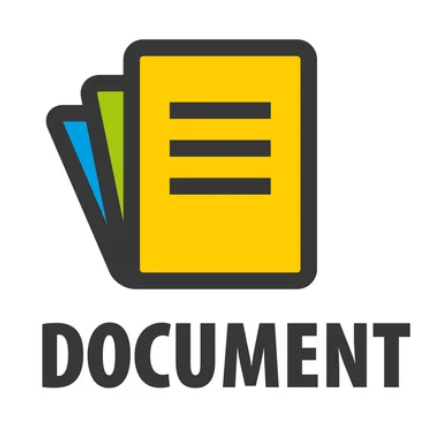

<!-- PROJECT LOGO -->
<br />
<div align="center">
   <h2 align="center">Py Repo To Adoc</h2>

  <a href="https://github.com/CFabien00/py_repo_to_adoc">
    
  </a>

  <p align="center">
    A python script that interprets all .py files to extract docstrings, parameters and returns and generate .adoc documentation.
    <br />
    <a href="https://github.com/CFabien00/py_repo_to_adoc"><strong>Explore »</strong></a>
    <br />
    <a href="https://github.com/CFabien00/py_repo_to_adoc/graphs/contributors"><strong>Contributors »</strong></a>
    <br />
    <a href="https://github.com/CFabien00/py_repo_to_adoc/blob/main/LICENSE"><strong>Licence »</strong></a>
    <br />
  </p>
</div>


<!-- GETTING STARTED -->

### Prerequisites

This script only works with Python 3.10+ projects.

### Installation

1. Clone the repo
   ```sh
   git clone https://github.com/github_username/repo_name.git
   ```
2. Run it with
    ```shell
    python3 py_repo_to_adoc
    ```
3. Follow instructions

<!-- USAGE EXAMPLES -->

## Usage

Once the script is run, it creates a file named `py_documentation.adoc` at the same place as the script.
